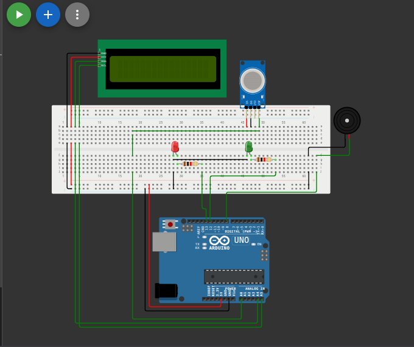

# نظام إنذار تسرب الغاز (Gas Leak Alarm System)

## وصف المشروع
نظام أمان متكامل يقوم بمراقبة مستوى الغاز في الهواء. عند تجاوز نسبة الغاز للحد الآمن، يقوم النظام بإطلاق إنذار صوتي عبر الطنان (Buzzer) وإضاءة مصباح تحذيري أحمر، مع عرض رسالة تنبيه على شاشة الـ LCD. وفي الحالة الطبيعية، يُضيء المصباح الأخضر وتظهر رسالة تؤكد جودة الهواء.

## المكونات المستخدمة
* لوحة أردوينو (Arduino)
* حساس الغاز (Gas Sensor - مثل MQ-2)
* شاشة عرض LCD مع وحدة I2C
* طنان (Buzzer)
* 2 x مصباح (LED أحمر و أخضر)
* أسلاك توصيل (Jumper Wires)

## صورة المشروع والتوصيلة

## رابط المشروع على Wokwi
[اضغط هنا لمشاهدة وتجربة المشروع على Wokwi](https://wokwi.com/projects/463022588964621313)

## شرح التوصيل (من الكود)
* حساس الغاز موصل بالطرف التناظري `A0`.
* الطنان (Buzzer) موصل بالطرف رقم `8`.
* مصباح الإنذار الأحمر موصل بالطرف رقم `13`.
* مصباح الحالة الطبيعية الأخضر موصل بالطرف رقم `12`.
* الشاشة موصلة عبر بروتوكول I2C (SDA, SCL) على العنوان `0x27`.

## طريقة العمل
يقرأ المتحكم القيمة التناظرية لحساس الغاز ويحولها إلى نسبة مئوية تُعرض على الشاشة. إذا زادت القيمة المقروءة عن `480`، يعتبر النظام وجود تسرب غاز، فيقوم بإصدار صوت متدرج عبر دالة `tone`، ويشغل المصباح الأحمر ويطفئ الأخضر مع كتابة "GAS LEAK!". وإذا كانت النسبة طبيعية، يطفئ الطنان ويشغل المصباح الأخضر ويكتب "Air Quality: OK".