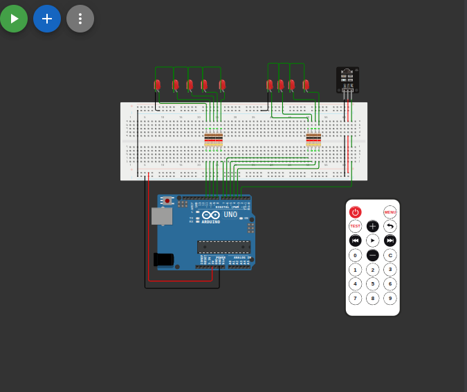

# التحكم بمجموعة مصابيح باستخدام ريموت الأشعة تحت الحمراء (IR Remote)

## وصف المشروع
مشروع يتيح التحكم في مجموعة من مصابيح الـ (LEDs) عن بعد باستخدام ريموت كنترول يعمل بالأشعة تحت الحمراء. عند الضغط على أزرار الأرقام من 1 إلى 9 في الريموت، يضيء المصباح المقابل وينطفئ الباقي. هناك أيضاً زر مخصص لإطفاء جميع المصابيح.

## المكونات المستخدمة
* لوحة أردوينو (Arduino)
* مستقبل أشعة تحت الحمراء (IR Receiver)
* ريموت كنترول (IR Remote)
* 9 x مصابيح (LEDs)
* مقاومات
* أسلاك توصيل (Jumper Wires)

## صورة المشروع والتوصيلة

## رابط المشروع على Wokwi
[اضغط هنا لمشاهدة وتجربة المشروع على Wokwi](https://wokwi.com/projects/463189403618888705)

## شرح التوصيل (من الكود)
* مستقبل الأشعة تحت الحمراء (IR Receiver) موصل بالطرف رقم `2`.
* المصابيح الـ 9 موصلة بالأطراف الرقمية من `3` إلى `11`.

## طريقة العمل
يستخدم المشروع مكتبة `IRremote.h`. في البداية يتم تعريف الأطراف كمخارج (للمصابيح) وتفعيل مستقبل الأشعة. عندما يستقبل الحساس إشارة من الريموت، يتم فك تشفيرها ومعرفة الزر المضغوط. تم ربط كود كل زر بدالة تقوم بإضاءة المصباح المخصص له وإطفاء الباقي، وهناك كود محدد لإطفاء كل المصابيح.