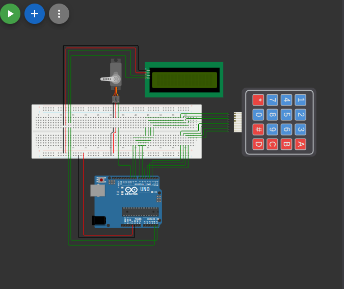

# قفل باب إلكتروني بكلمة مرور (Keypad Door Lock)

## وصف المشروع
نظام قفل باب ذكي يتطلب إدخال كلمة مرور صحيحة عبر لوحة المفاتيح (Keypad) لفتح الباب. يظهر على الشاشة (LCD) رسائل إرشادية للمستخدم، وعند إدخال الرمز الصحيح (1234)، يفتح القفل (يتمثل في حركة محرك السيرفو) وتظهر رسالة السماح بالدخول. وإذا كان الرمز خاطئاً، تظهر رسالة رفض الدخول.

## المكونات المستخدمة
* لوحة أردوينو (Arduino)
* لوحة مفاتيح (4x4 Keypad)
* محرك سيرفو (Servo Motor - كقفل للباب)
* شاشة عرض LCD مع وحدة I2C
* أسلاك توصيل (Jumper Wires)

## صورة المشروع والتوصيلة

## رابط المشروع على Wokwi
[اضغط هنا لمشاهدة وتجربة المشروع على Wokwi](https://wokwi.com/projects/462868546660159489)

## شرح التوصيل (من الكود)
* محرك السيرفو موصل بالطرف رقم `10`.
* أطراف الصفوف (Rows) للوحة المفاتيح موصلة بالأطراف `6, 7, 8, 9`.
* أطراف الأعمدة (Cols) للوحة المفاتيح موصلة بالأطراف `2, 3, 4, 5`.
* الشاشة موصلة عبر بروتوكول I2C.

## طريقة العمل
يعتمد الكود على قراءة الأرقام المدخلة من الـ Keypad وتخزينها حتى تكتمل 4 أرقام (الرمز الافتراضي هو 1234). عند اكتمال الإدخال، يتم مقارنة الرمز بالرمز المحفوظ. في حال التطابق، يتحرك محرك السيرفو لزاوية 90 درجة لفتح القفل وينتظر 3 ثوانٍ قبل أن يعود ليغلق. تُستخدم الشاشة لعرض النجوم (*) أثناء كتابة الرمز وعرض رسائل القبول أو الرفض.