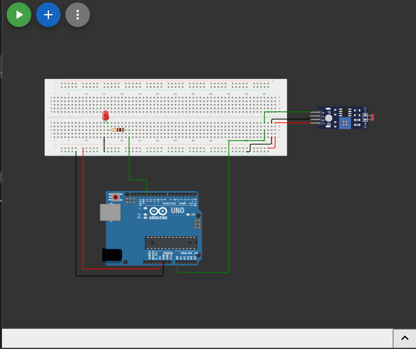

# نظام إضاءة ذكي حساس للضوء (LDR Sensor)

## وصف المشروع
يهدف هذا المشروع إلى التحكم الأوتوماتيكي في الإضاءة بناءً على مستوى الإضاءة المحيطة. يعتمد على مقاومة متغيرة للضوء (LDR)، حيث يضيء مصباح الـ LED تلقائياً عندما تكون الإضاءة المحيطة ضعيفة أو معتمة، وينطفئ عندما تكون الإضاءة قوية.

## المكونات المستخدمة
* لوحة أردوينو (Arduino)
* حساس الضوء (LDR - Light Dependent Resistor)
* مصباح (LED)
* مقاومات
* أسلاك توصيل (Jumper Wires)

## صورة المشروع والتوصيلة

## رابط المشروع على Wokwi
[اضغط هنا لمشاهدة وتجربة المشروع على Wokwi](https://wokwi.com/projects/462840303150195713)

## شرح التوصيل (من الكود)
* حساس الضوء (LDR) موصل بالطرف التناظري `A0`.
* مصباح LED موصل بالطرف رقم `13`.

## طريقة العمل
يقرأ الأردوينو القيمة التناظرية من الحساس باستمرار، والتي تتأثر بكمية الضوء الساقط عليه. يتم استخدام جملة شرطية `if`، فإذا تجاوزت القيمة المقروءة 500 (مما يعني انخفاض مستوى الإضاءة)، يتم إرسال إشارة عالية (HIGH) لإضاءة المصباح. بخلاف ذلك، يتم إطفاؤه.