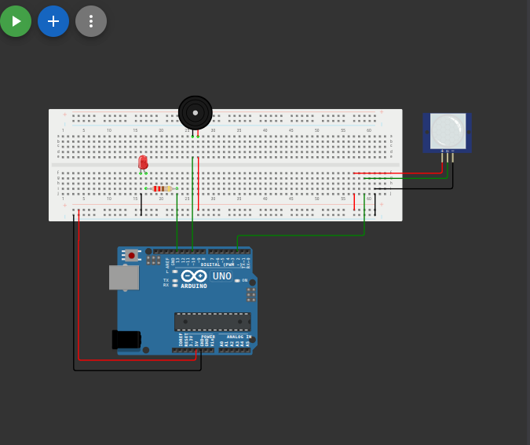

# نظام إنذار حساس للحركة (PIR Motion Sensor)

## وصف المشروع
نظام أمان يقوم باكتشاف أي حركة في المكان باستخدام حساس الحركة (PIR). بمجرد رصد حركة، يقوم النظام بتشغيل إنذار صوتي عبر الطنان (Buzzer) وإضاءة مصباح كتحذير مرئي، مع طباعة رسالة تنبيه عبر مراقب السيريال (Serial Monitor).

## المكونات المستخدمة
* لوحة أردوينو (Arduino)
* حساس الحركة (PIR Motion Sensor)
* مصباح (LED)
* طنان (Buzzer)
* أسلاك توصيل (Jumper Wires)

## صورة المشروع والتوصيلة

## رابط المشروع على Wokwi
[اضغط هنا لمشاهدة وتجربة المشروع على Wokwi](https://wokwi.com/projects/462764333130023937)

## شرح التوصيل (من الكود)
* حساس الحركة (PIR) موصل بالطرف رقم `2`.
* مصباح الـ LED موصل بالطرف رقم `13`.
* الطنان (Buzzer) موصل بالطرف رقم `10`.

## طريقة العمل
يتم مراقبة الطرف الخاص بحساس الحركة، فعندما يستشعر الحساس أي حرارة جسم متحرك، يرسل إشارة عالية (HIGH) للأردوينو. عندها يعمل الأردوينو على إضاءة الـ LED وإصدار صوت نغمة بتردد 1000Hz عبر الطنان. وعند انتهاء الحركة، تعود الإشارة إلى منخفضة (LOW) ليتوقف الإنذار والإضاءة.