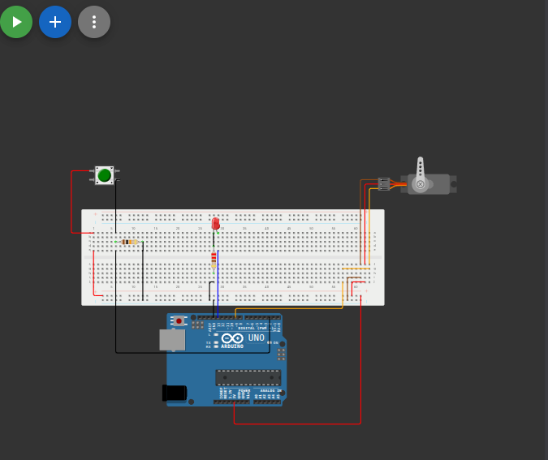

# البوابة الذكية (Smart Gate)

## وصف المشروع
مشروع بوابة ذكية تفتح عند الضغط على زر (Push Button). يوضح المشروع كيفية استخدام مدخلات للتحكم في حركة محرك السيرفو لفتح وإغلاق البوابة، مع وجود مؤشر ضوئي (LED) يدل على حالة البوابة (مفتوحة/مغلقة).

## المكونات المستخدمة
* لوحة أردوينو (Arduino)
* محرك سيرفو (Servo Motor)
* زر ضاغط (Push Button)
* مصباح (LED)
* أسلاك توصيل (Jumper Wires)

## صورة المشروع والتوصيلة

## رابط المشروع على Wokwi
[اضغط هنا لمشاهدة وتجربة المشروع على Wokwi](https://wokwi.com/projects/462400519693322241)

## شرح التوصيل (من الكود)
* الزر الضاغط موصل بالطرف رقم `2`.
* مصباح الـ LED موصل بالطرف رقم `13`.
* محرك السيرفو (البوابة) موصل بالطرف رقم `9`.

## طريقة العمل
يقرأ الأردوينو حالة الزر الضاغط. إذا تم الضغط عليه، يضيء الـ LED وتتحرك البوابة (السيرفو) لزاوية 0 درجة للفتح وتنتظر لمدة 3 ثوانٍ. وإذا لم يُضغط على الزر، ينطفئ المصباح وتظل البوابة مغلقة على زاوية 90 درجة.