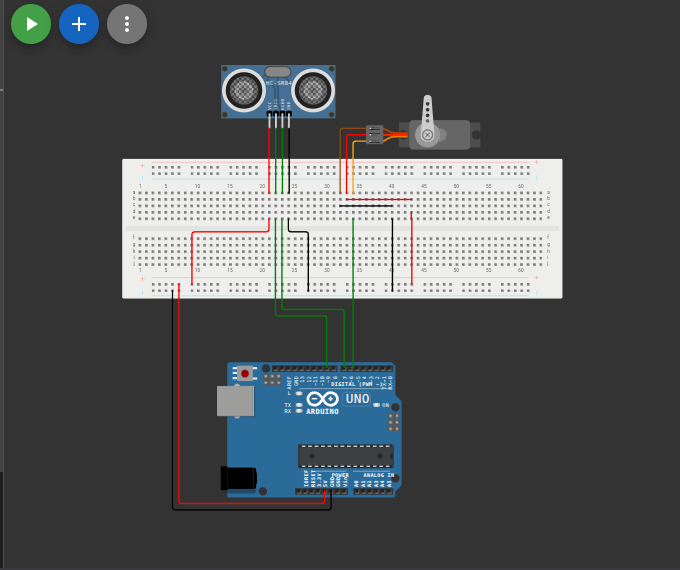

# نظام البوابة الذكية بدون لمس (Smart Touchless Gate System)

## وصف المشروع
بوابة أوتوماتيكية تفتح وتغلق بدون أي تلامس. يستخدم هذا المشروع حساس الموجات فوق الصوتية (Ultrasonic Sensor) لقياس المسافة واكتشاف اقتراب شخص أو سيارة، وبناءً عليه يتم تحريك محرك السيرفو لفتح البوابة.

## المكونات المستخدمة
* لوحة أردوينو (Arduino)
* حساس موجات فوق صوتية (Ultrasonic Sensor - HC-SR04)
* محرك سيرفو (Servo Motor)
* أسلاك توصيل (Jumper Wires)

## صورة المشروع والتوصيلة

## رابط المشروع على Wokwi
[اضغط هنا لمشاهدة وتجربة المشروع على Wokwi](https://wokwi.com/projects/462402301401328641)

## شرح التوصيل (من الكود)
* محرك السيرفو موصل بالطرف رقم `6`.
* طرف إرسال الموجة (Trig) للحساس موصل بالطرف رقم `9`.
* طرف استقبال الموجة (Echo) للحساس موصل بالطرف رقم `7`.

## طريقة العمل
يُرسل حساس الموجات فوق الصوتية نبضة صوتية ثم يحسب الوقت المستغرق لعودة الصدى. يتم تحويل هذا الوقت إلى مسافة فعلية. إذا كانت المسافة المحسوبة أقل من 20 سم وأكبر من الصفر، يرسل الأردوينو أمراً للسيرفو للتحرك إلى زاوية 90 درجة لفتح البوابة، وينتظر 3 ثوانٍ قبل الإغلاق. وإذا لم يوجد شيء قريباً تبقى البوابة مغلقة على زاوية 0.