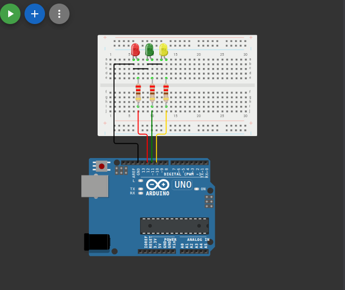

# إشارة المرور (Traffic Light)

## وصف المشروع
محاكاة مبسطة لنظام إشارات المرور الضوئية الموجود في الشوارع. يقوم المشروع بتشغيل ثلاثة مصابيح (أحمر، أخضر، أصفر) بتتابع زمني محدد لتنظيم حركة السير الافتراضية.

## المكونات المستخدمة
* لوحة أردوينو (Arduino)
* 3 x مصابيح (أحمر، أخضر، أصفر)
* مقاومات
* أسلاك توصيل (Jumper Wires)

## صورة المشروع والتوصيلة

## رابط المشروع على Wokwi
[اضغط هنا لمشاهدة وتجربة المشروع على Wokwi](https://wokwi.com/projects/462384760253805569)

## شرح التوصيل (من الكود)
* المصباح الأحمر موصل بالطرف رقم `12`.
* المصباح الأخضر موصل بالطرف رقم `11`.
* المصباح الأصفر موصل بالطرف رقم `10`.

## طريقة العمل
يستخدم الكود دوال `digitalWrite` و `delay` للتبديل بين المصابيح. حيث يضيء المصباح الأحمر لمدة ثانية مع إطفاء الباقي، ثم الأخضر لمدة ثانية، ثم الأصفر لمدة نصف ثانية، وتتكرر هذه الدورة بشكل مستمر محاكيةً إشارة المرور الحقيقية.