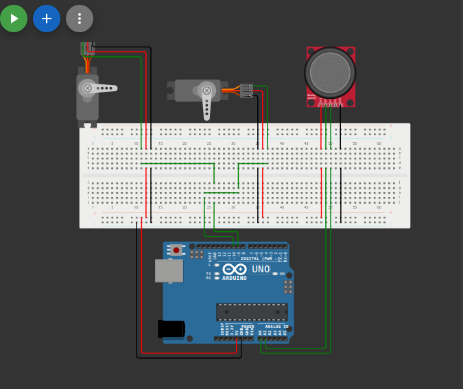

# التحكم بمحركين سيرفو باستخدام عصا التوجيه (Joystick)

## وصف المشروع
يقوم هذا المشروع بقراءة القيم التناظرية من عصا التوجيه (Analog Joystick) وتحويل هذه القيم إلى زوايا (من 0 إلى 180 درجة) للتحكم في حركة محركين من نوع سيرفو (Servo Motors). يمكن استخدامه كتطبيق أساسي للتحكم في الأذرع الآلية أو الكاميرات الموجهة (Pan/Tilt).

## المكونات المستخدمة
* لوحة أردوينو (Arduino)
* عصا توجيه (Analog Joystick)
* 2 x محرك سيرفو (Servo Motor)
* أسلاك توصيل (Jumper Wires)

## صورة المشروع والتوصيلة

## شرح التوصيل (من الكود)
* السيرفو الأول (ServoX) موصل بالطرف رقم `10`.
* السيرفو الثاني (ServoY) موصل بالطرف رقم `9`.
* محور X لعصا التوجيه موصل بالطرف التناظري `A1`.
* محور Y لعصا التوجيه موصل بالطرف التناظري `A0`.

## طريقة العمل
يعتمد الكود على قراءة القيم عبر دالة `analogRead` من `0` إلى `1023`، ثم استخدام دالة `map` لتحويل هذا النطاق إلى نطاق الزوايا الخاص بمحرك السيرفو `0` إلى `180` درجة، وبعدها إرسال الزاوية للمحركات باستخدام دالة `write`.