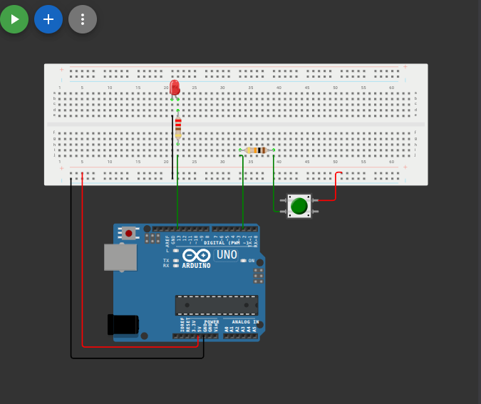

# التحكم بمصباح LED باستخدام زر ضاغط (Push Button)

## وصف المشروع
مشروع بسيط يوضح كيفية استخدام الزر الضاغط (Push Button) كإدخال رقمي (Digital Input) للتحكم في إضاءة مصباح LED كإخراج رقمي (Digital Output). يضيء المصباح عند الضغط على الزر وينطفئ عند إفلاته.

## المكونات المستخدمة
* لوحة أردوينو (Arduino)
* زر ضاغط (Push Button)
* مصباح (LED)
* مقاومات
* أسلاك توصيل (Jumper Wires)

## صورة المشروع والتوصيلة

## شرح التوصيل (من الكود)
* الزر الضاغط موصل بالطرف رقم `2`.
* مصباح LED موصل بالطرف رقم `13`.

## طريقة العمل
يتم ضبط طرف الزر كمدخل وطرف الـ LED كمخرج. في حلقة `loop`، يقرأ الأردوينو حالة الزر باستخدام `digitalRead`، فإذا كانت الحالة عالية (HIGH) يتم إضاءة المصباح، وإلا يتم إطفاؤه.