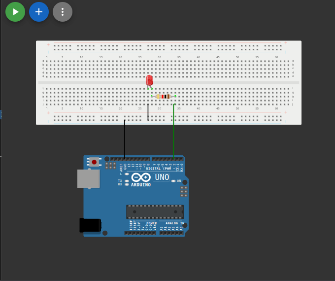

# وميض مصباح LED (Blinking LED)

## وصف المشروع
يعد هذا المشروع من أبسط المشاريع وأول خطوة في عالم الأردوينو. يقوم البرنامج بتشغيل مصباح LED وإطفائه بشكل متكرر مع وجود فاصل زمني (تأخير - Delay) بين كل حالة وأخرى.

## المكونات المستخدمة
* لوحة أردوينو (Arduino)
* مصباح (LED)
* مقاومة
* أسلاك توصيل (Jumper Wires)

## صورة المشروع والتوصيلة

## رابط المشروع على Wokwi
[اضغط هنا لمشاهدة وتجربة المشروع على Wokwi](https://wokwi.com/projects/461856162199310337)

## شرح التوصيل (من الكود)
* مصباح LED موصل بالطرف رقم `2`.

## طريقة العمل
يقوم الكود بإرسال إشارة عالية (HIGH) لتشغيل الـ LED، ثم ينتظر لمدة ثانية واحدة (1000 ملي ثانية) باستخدام دالة `delay`. بعد ذلك، يرسل إشارة منخفضة (LOW) لإطفاء الـ LED، وينتظر ثانية أخرى. وتتكرر هذه العملية باستمرار.