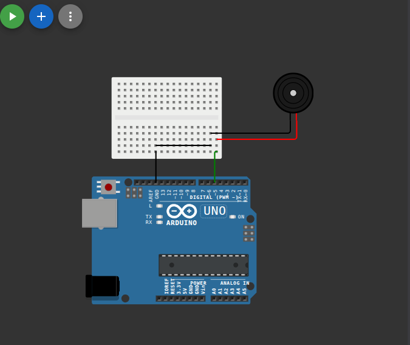

# إنذار صوتي بسيط (Simple Buzzer)

## وصف المشروع
مشروع بسيط يوضح كيفية استخدام الطنان (Buzzer) لإصدار أصوات ونغمات وتنبيهات. يقوم الكود بتشغيل وإطفاء الطنان بفواصل زمنية محددة لعمل صوت إنذار متقطع.

## المكونات المستخدمة
* لوحة أردوينو (Arduino)
* طنان نشط (Active Buzzer)
* أسلاك توصيل (Jumper Wires)

## صورة المشروع والتوصيلة

## رابط المشروع على Wokwi
[اضغط هنا لمشاهدة وتجربة المشروع على Wokwi](https://wokwi.com/projects/462402822039286785)

## شرح التوصيل (من الكود)
* الطنان (Buzzer) موصل بالطرف رقم `5`.

## طريقة العمل
يعتمد الكود على إرسال إشارة رقمية عالية (HIGH) لتشغيل الطنان، ثم استخدام دالة التأخير (Delay) لمدة نصف ثانية (500ms). بعد ذلك، يرسل إشارة منخفضة (LOW) لإطفاء الطنان لمدة 300 ملي ثانية. وتتكرر هذه العملية في حلقة مستمرة.