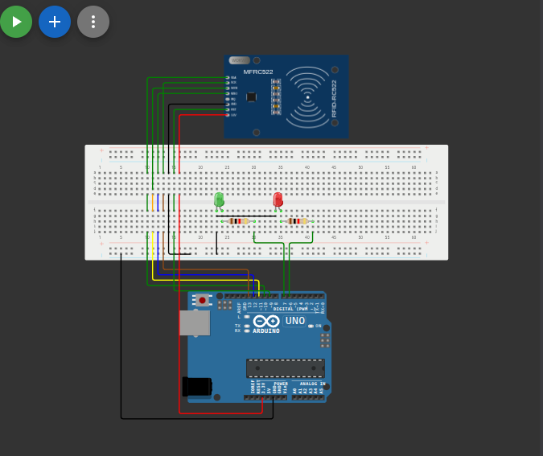

# بوابة ذكية بنظام بطاقات RFID (Smart Gate with RFID)

## وصف المشروع
نظام تحكم في الدخول يعتمد على تقنية تحديد الهوية بموجات الراديو (RFID). يقرأ النظام الرقم التعريفي (UID) الخاص بالبطاقة الممررة. إذا كانت البطاقة مصرحاً لها، يتم إضاءة المصباح الأخضر للسماح بالدخول. وإذا كانت البطاقة غير معرفة، يضيء المصباح الأحمر لرفض الدخول.

## المكونات المستخدمة
* لوحة أردوينو (Arduino)
* قارئ بطاقات RFID (MFRC522)
* بطاقة/ميدالية RFID
* مصباح أخضر (Green LED)
* مصباح أحمر (Red LED)
* أسلاك توصيل (Jumper Wires)

## صورة المشروع والتوصيلة

## رابط المشروع على Wokwi
[اضغط هنا لمشاهدة وتجربة المشروع على Wokwi](https://wokwi.com/projects/463198201598476289)

## شرح التوصيل (من الكود)
* قارئ الـ RFID موصل عبر بروتوكول SPI حيث طرف التفعيل `SS` برقم `10` وطرف إعادة الضبط `RST` برقم `9`.
* المصباح الأخضر (للدخول المصرح) موصل بالطرف رقم `7`.
* المصباح الأحمر (للدخول المرفوض) موصل بالطرف رقم `6`.

## طريقة العمل
يتم تهيئة الاتصال عبر SPI وقارئ البطاقات في دالة الإعداد. وفي حلقة العمل المستمرة، يبحث النظام عن بطاقة جديدة ويقوم بقراءة رقمها التسلسلي (UID). يُقارن الرقم المدخل بالرقم المحفوظ برمجياً `"11 22 33 44"`. في حالة التطابق يتم إرسال رسالة قبول على الشاشة وتشغيل المصباح الأخضر، وفي حال الرفض يُشغل المصباح الأحمر وتطبع رسالة الرفض.